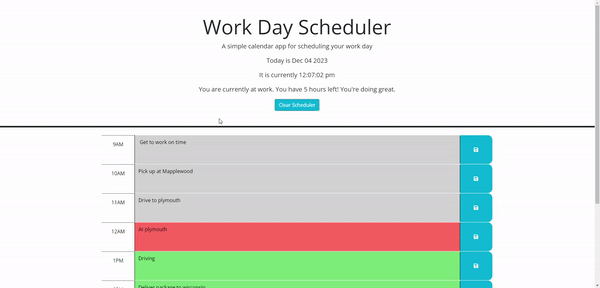

# Work Scheduler App
This is a work Scheduler app to help out people write down important work related tasks and to keep them stored locally for future use 
## Description
This is a work scheduler app that helps out people who start work at 9am and end at 5pm keep track of daily tasks. If a time block is a time in the future the color of the block will be green. If the the time block is the current time the color will be red and if the time block has already past it will be grey.
## How to use the app
To use the app simply load up the website and type your tasks in the corresponding time block. Once done click the save button. Any text in the input boxes will be saved and stored locally for future use. If you need to clear out the whole day press the clear scheduler button and input your new tasks.

## Source Code 
The html and the css pages were a boiler plate given to me by my boot-camp. Minimal changes to the boiler plate were done. 
## Contact information

Email : <joseortiz0918@gmail.com> 

Github : <https://github.com/Joseortiz0918>

## License

This project is licensed under the MIT License - see the LICENSE.md file for details